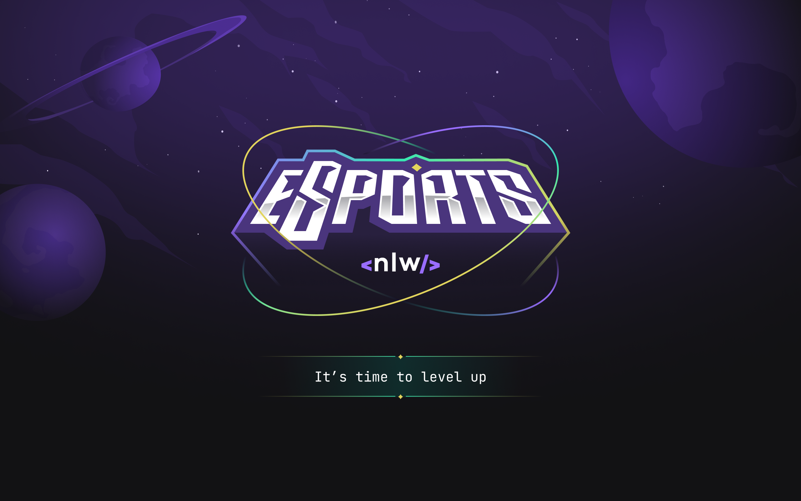
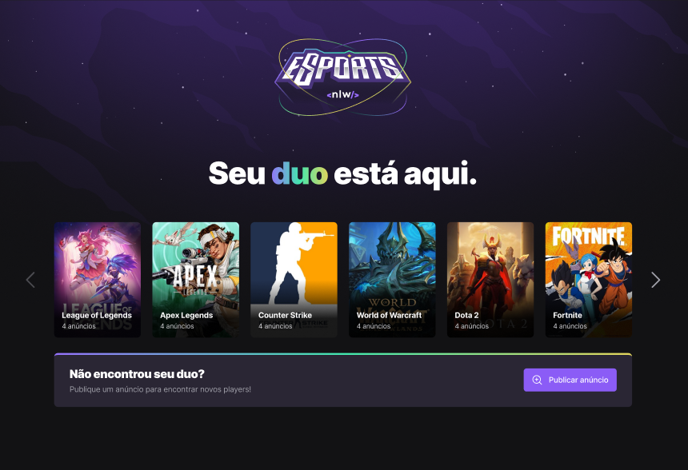
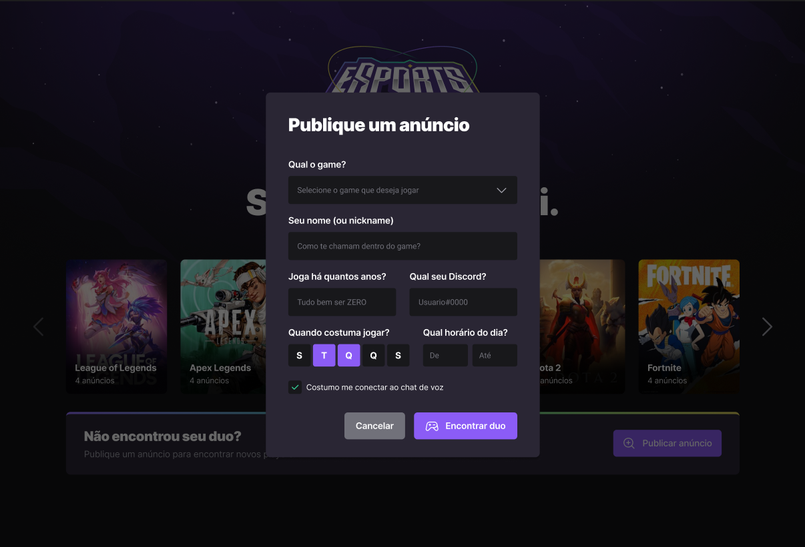

# NLW eSports

Bem vindo ao sistema do NLW eSports.
Desenhado pela [RockeatSeat](https://www.rocketseat.com.br/) para o NLW eSports esse sistema que integra web e mobile com o mesmo banco de dados, serve para juntar pessoas que querem o duo ideal na hora da gameplay.

## Linguagens e frameworks e Bibliotecas utilizados

[ReactJS](https://pt-br.reactjs.org/)
[TypeScript](https://www.typescriptlang.org/)
[NodeJS](https://nodejs.org/en/)
[React Native](https://reactnative.dev/)
[Express](https://expressjs.com/pt-br/)
[Tailwind](https://tailwindcss.com/)
[phosphor](https://phosphoricons.com/)
[Prisma](https://www.prisma.io/)
[SQLite](https://www.sqlite.org/index.html)
[Radix UI](https://www.radix-ui.com/)

- [X] Back-end
- [X] Web
- [X] Mobile

## Utils

[Figma](https://www.figma.com/file/UU9wkb3NT1ruRTmk055TT3/NLW-eSports?node-id=6%3A23) do projeto
